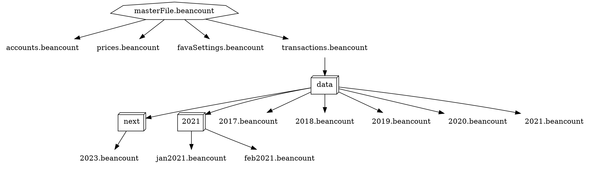

# JBeancount

This is a complementary tool and library for the [Beancount](https://github.com/beancount/beancount/) [*Plain Text
Accounting*](https://plaintextaccounting.org/) solution written primarily for consumption by JVM languages like Java,
Kotlin and Scala.

It features a parser capable of ([almost*](#present-shortcomings)) fully parsing Beancount journals.

This library addresses some shortcomings in the original Beancount architecture.
It *tries* not to discard tokens (like comments) and does not process pragmas at parsing time.

> **Warning** This library is not a Beancount replacement, or extension. It is solely a supplementary program.

## Updates

This codebase is in active development.
The first release will soon be made on GitHub.
This will include a Maven artifact and version-pinned binaries.
Don't forget to watch the repository.


## CLI

Commandline binaries are available for Windows and Linux (built on Ubuntu) on
the [GitHub Actions](https://github.com/jord1e/jbeancount/actions/workflows/main.yml) page (select the latest successful
building commit, and download it from the artifacts section).

```shell
$ jbeancount --help
Usage: jbeancount [-hV] [COMMAND]
Extension utilities for the Beancount plain text accounting tool
  -h, --help      Show this help message and exit.
  -V, --version   Print version information and exit.
Commands:
  merge     This command (recursively) merges all journals included using
              include pragmas, and creates one composite journal
  format    This command formats a journal (just like bean-format, but better)
  check     Checks the beancount file for errors
  includes  This command dumps the include pragma mappings
  internal  Internal commands to debug the utility and library
  sort      This command sorts the transactions in a Beancount file
```

### Sorting transactions

> **Note** This tool currently only sorts consecutive transactions in files.
> In the future, a better sorting heuristic will be implemented.
> It takes the current line into account as a secondary sorting parameter.
> This means that transaction order on the same dates is maintained.

Transactions frequently become unsorted.
This often happens because you have multiple importers or manually write down transactions.
Without this tool, the process of resolving this would be manual.

```shell
$ cat sort.beancount
2022-01-02 * "Should be 2nd"
2022-01-01 * "Should be 1st"
2022-01-03 * "Should be 3rd"
# Output to stdout
$ jbeancount sort sort.beancount
2022-01-01 * "Should be 1st"
2022-01-02 * "Should be 2nd"
2022-01-03 * "Should be 3rd"
# Output to a file
$ jbeancount sort sort.beancount -o sort.beancount
2022-01-01 * "Should be 1st"
2022-01-02 * "Should be 2nd"
2022-01-03 * "Should be 3rd"
$ cat sort.beancount
2022-01-01 * "Should be 1st"
2022-01-02 * "Should be 2nd"
2022-01-03 * "Should be 3rd"
```

### Combining multiple files

The `merge` command merges one or more Beancount files together into one coherent file.

You can redirect output to either stdout, or a file.

By specifying the `--recursive` (short: `-r`) option,
files included by the use of `include` pragmas will also be merged.

By default, `include` pragmas are removed from the merged file.
This behaviour can be counteracted by specifying the `--keep-include-pragmas` option.

```shell
$ ls -1
one.beancount
two.beancount
$ cat one.beancount && echo "---" && cat two.beancount
2022-01-01 * "From file one"
---
2022-01-02 * "From file two"
# Output to stdout
$ jbeancount merge one.beancount two.beancount
2022-01-01 * "From file one"
2022-01-02 * "From file two"
# Output to a file
$ jbeancount merge one.beancount two.beancount -o three.beancount
$ ls -1
one.beancount
two.beancount
three.beancount
$ cat three.beancount
2022-01-01 * "From file one"
2022-01-02 * "From file two"
```

### Formatting your journal

> **Warning** The formatting tool is unfinished.
> It works best on a file containing only transactions.
> In the future, it will be improved to handle other directives better
> (i.e. pad with balance constructs and comment-seperated grouping).

The CLI contains a tool (`jbeancount format`) for formatting your journals.

<details><summary>:wastebasket: Before formatting</summary>
<p>

```shell
$ cat format.beancount
2022-01-01 query "test-query" "
  Test"
2022-01-01 balance Assets:Current:Z                  42323.234 ZZZ #b ^a #c ^d ^e
  ^k
2022-01-01 balance Assets:Current:Z                            (1 +    4) EUR ^a
2022-01-01 balance Assets:Savings:F                       100000.00              USD
  az:
  bf: "c"
  de: EUR
  ^k
2022-01-01 balance Liabilities:A:A              -567567.566 CHF ^test #test2
  xx: "ab"
2022-01-01 balance Assets:Current:B                       -(-456.13 + (+2 *    -3) /(3-  1)) EUR
  ab:

2022-01-01 open Assets:Current:Z EUR,CHF

2022-01-01 price EUR                    1.5675675672344 USD
2022-01-01 price EUR                    1.5675673434231 USD
2022-01-01 price EUR                    1.3452523532523 USD

2022-01-01 commodity EUR
  name: "Euro"
  ; Comment here
  price: "USD:yahoo/EUR_USD=X"

2022-01-01 * "EUR > CHF" #a ^b #c ^d ^e #f
  time: "24:13"
  Assets:Current:A                              -30.00 EUR @@ 55.77 CHF
    az:
    bf: "c"
    de: EUR
    ^k
  Assets:Current:A                               55.77 CHF
    fg: 1.2
    fh: Assets:Account:In:Metadata
2022-01-01 commodity USD
  name: "US$"
2022-01-01 * "Buy stock"
  time: "66:66"
  Assets:Brokerage:GG                   0.345435435 GG {435.333 EUR, ","} @ 14.444 USD
  !Assets:Cash                      -21.44 USD

2022-01-01 * "Sell Stock"
  Assets:Brokerage:GG                           -1 GG {} @@ 2354325.122 USD
  Assets:Cash                      324324.23 USD
  Income:Investments:PnL

2022-01-01 ! "CompanyPayee" "Salary" #salary
  Assets:Current:Z                              100.00 EUR
    ^with-salary
  Income:CoolCompany:Salary                                   -100.00
```

</p>
</details>

<details><summary>:sparkles: After formatting</summary>
<p>

> **Note** Notice that all commodities (currencies) are aligned.

```shell
$ jbeancount format format.beancount
2022-01-01 query "test-query" "
  Test"
2022-01-01 balance Assets:Current:Z               42323.234 ZZZ #b ^a #c ^d ^e
  ^k
2022-01-01 balance Assets:Current:Z                 (1 + 4) EUR ^a
2022-01-01 balance Assets:Savings:F               100000.00 USD
  az:
  bf: "c"
  de: EUR
  ^k
2022-01-01 balance Liabilities:A:A              -567567.566 CHF ^test #test2
  xx: "ab"
2022-01-01 balance Assets:Current:B -(-456.13 + (+2 * -3) / (3 - 1)) EUR
  ab:
2022-01-01 open Assets:Current:Z EUR,CHF
2022-01-01 price EUR                        1.5675675672344 USD
2022-01-01 price EUR                        1.5675673434231 USD
2022-01-01 price EUR                        1.3452523532523 USD
2022-01-01 commodity EUR
  name: "Euro"
  ; Comment here
  price: "USD:yahoo/EUR_USD=X"
2022-01-01 * "EUR > CHF" #a ^b #c ^d ^e #f
  time: "24:13"
  Assets:Current:A                                   -30.00 EUR @@ 55.77 CHF
    az:
    bf: "c"
    de: EUR
    ^k
  Assets:Current:A                                    55.77 CHF
    fg: 1.2
    fh: Assets:Account:In:Metadata

2022-01-01 commodity USD
  name: "US$"
2022-01-01 * "Buy stock"
  time: "66:66"
  Assets:Brokerage:GG                           0.345435435 GG {435.333 EUR, ","} @ 14.444 USD
  !Assets:Cash                                       -21.44 USD

2022-01-01 * "Sell Stock"
  Assets:Brokerage:GG                                    -1 GG {} @@ 2354325.122 USD
  Assets:Cash                                     324324.23 USD
  Income:Investments:PnL

2022-01-01 ! "CompanyPayee" "Salary" #salary
  Assets:Current:Z                                   100.00 EUR
    ^with-salary
  Income:CoolCompany:Salary                         -100.00
```

</p>
</details>

### Inclusion tree

The CLI features the `includes` command which you can use to print the inclusion tree.
It supports optional (and experimental, currently) [Graphviz DOT](https://graphviz.org/) output.

```shell
# Windows batch tree command
$ tree /F /A
C:.
|   accounts.beancount
|   favaSettings.beancount
|   masterFile.beancount
|   prices.beancount
|   transactions.beancount
|
\---data
    |   2017.beancount
    |   2018.beancount
    |   2019.beancount
    |   2020.beancount
    |
    +---2021
    |       feb2021.beancount
    |       jan2021.beancount
    |
    \---next
            2023.beancount

$ jbeancount includes masterFile.beancount --experimental-relative --experimental-dot | dot -Tpng -Kdot -ohierarchy.png
```

This results in the following image being created:


<details><summary>Graphviz DOT output</summary>
<p>

Try it out
on [Graphviz Online](https://dreampuf.github.io/GraphvizOnline/#strict%20digraph%20%7B%0A%20%20node%20%5Bshape%3Dplaintext%5D%0A%20%20%22masterFile.beancount%22%20%5Bshape%3Dseptagon%5D%0A%20%20%22next%22%20%5Bshape%3Dbox3d%5D%0A%20%20%22data%22%20%5Bshape%3Dbox3d%5D%0A%20%20%222021%22%20%5Bshape%3Dbox3d%5D%0A%20%20%22masterFile.beancount%22%20-%3E%20%22accounts.beancount%22%0A%20%20%22masterFile.beancount%22%20-%3E%20%22prices.beancount%22%0A%20%20%22masterFile.beancount%22%20-%3E%20%22favaSettings.beancount%22%0A%20%20%22masterFile.beancount%22%20-%3E%20%22transactions.beancount%22%0A%20%20%22transactions.beancount%22%20-%3E%20%22data%22%20-%3E%20%222017.beancount%22%0A%20%20%22transactions.beancount%22%20-%3E%20%22data%22%20-%3E%20%222018.beancount%22%0A%20%20%22transactions.beancount%22%20-%3E%20%22data%22%20-%3E%20%222019.beancount%22%0A%20%20%22transactions.beancount%22%20-%3E%20%22data%22%20-%3E%20%222020.beancount%22%0A%20%20%22transactions.beancount%22%20-%3E%20%22data%22%20-%3E%20%222021.beancount%22%0A%20%20%22transactions.beancount%22%20-%3E%20%22data%22%20-%3E%20%222021%22%20-%3E%20%22jan2021.beancount%22%0A%20%20%22transactions.beancount%22%20-%3E%20%22data%22%20-%3E%20%222021%22%20-%3E%20%22feb2021.beancount%22%0A%20%20%22transactions.beancount%22%20-%3E%20%22data%22%20-%3E%20%22next%22%20-%3E%20%222023.beancount%22%0A%7D%0A)
.



</p>
</details>

## Using the library

> **Warning** The library is currently in active development and API stability is **not** guaranteed.

This section will be written at a later time.

## Present shortcomings

Currently, the `pushtag` and `poptag` pragmas are unsupported at the printer level.
They are parsed but nothing is done with them.

Only line comments beginning with `;`, are currently supported.

The parser currently does not recognise (or ignore) unknown lines (i.e. ones starting with `*`).

The printer is currently unable to completely restructure the original input file(s).
In the future, this should be possible.
All commands will presently output formatted journals.
